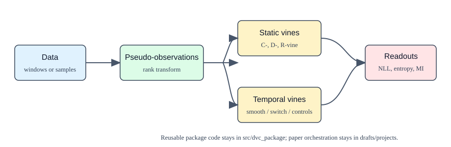

# Dynamic Vine Copulas Documentation

Dynamic Vine Copulas (DVC) provides reusable tools for static and temporal
vine-copula modeling. The public package focuses on general-purpose fitting,
evaluation, simulation, and reproducible experiment configuration.

## Start Here

- [Setup](setup.md): install the package and validate the environment.
- [Repository structure](structure.md): understand what belongs in the public
  release and what belongs in project workspaces.
- [Static fitting](user-guide/fitting.md): fit C-, D-, and R-vines.
- [Evaluation](user-guide/evaluation.md): score, sample, and compute
  information-theoretic summaries.
- [Time-dependent models](user-guide/time-dependent.md): fit and compare
  temporal C-vine variants.
- [Experiments](user-guide/experiments.md): run YAML-configured benchmarks.
- [Schematics](schematics.md): model and release-boundary diagrams.

## Reference

- [Core API](reference/core-api.md)
- [Time API](reference/time-api.md)
- [Experiment API](reference/experiments-api.md)

## Release and Paper Reproduction

- [Release plan](release-plan.md)
- [Data release plan](data-release.md)

The paper-specific workspace under `drafts/` is intentionally excluded from the
public package boundary until a dedicated reproduction bundle is prepared.
